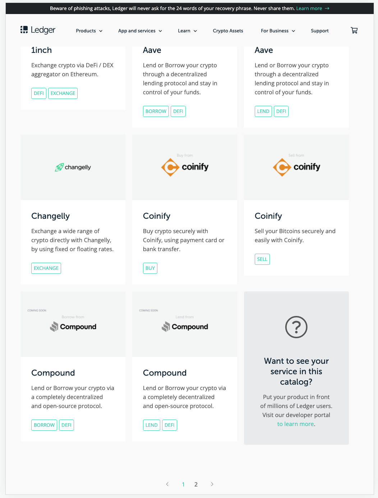
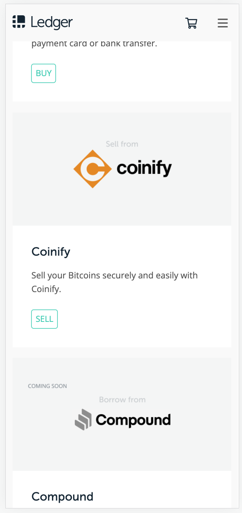

# Ledger Ecommerce Front End Take Home

## Objectives

The main goal of this take home is to build a responsive website which filters a list of data from an API.

You are expected to make requests to get mock data from this API [endpoint].

Use the data from the API endpoint to populate the cards and sections of the mock up.

## The completed result should include:

- A Javascript file containing code to fetch the data and filter the list
- A SCSS file containinig styles for the page.

## Also try to

- Style the layout to match the mockups.

## Use placeholder images from

- [picsum]

## The completed result should not include:

- Bootstrap styles.

# Getting Started

- Fork and clone this repository and cd into the project directory

## Install the dependencies

```sh
npm install
```

## Launch the application by running

```sh
npm run dev:start
```

## Dev workflow

- visit [devUrl] to view the application
- Use HTML/CSS/JS to build the required application.
- Do not use any additional libraries to complete the task.
- Make as many commits as you wish.
- When you modify the /src/css/main.scss or /src/css/main.js files, the browser is refreshed.
- After completing the take home the deliverable is the URL of your fork.

### Desktop mock up



### Mobile mock up



[endpoint]: https://jsonplaceholder.typicode.com/
[picsum]: https://picsum.photos/
[devurl]: http://localhost:4019
